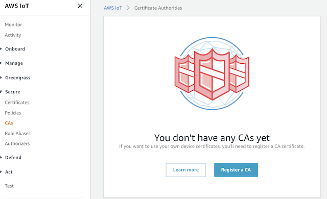
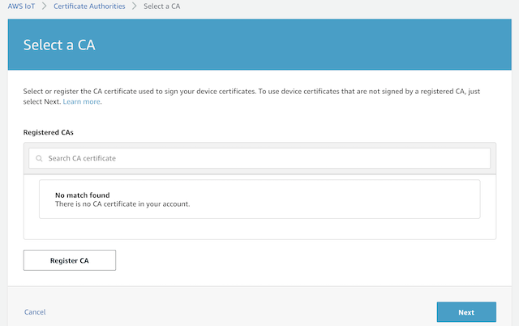
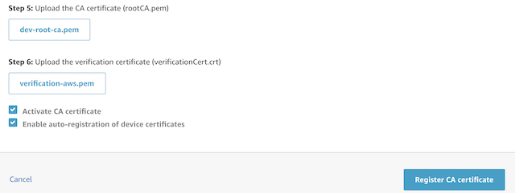

# Device Certificate

Each device should have its own certificate with its `Common Name` set to the device identifier.  There are two sides to secure communication, this blog show how to create the certificates that the device will use to encrypt the data and how the cloud side will decrypt the data.  So that the device knowns how to read the data coming from the cloud we will need a public cert/key to do the decryption.  The details on these certs can be found in [DeviceConfigSetup.md](./DeviceConfigSetup.md) `Azure Information Section` and `AWS Information Section` sections.

## Device Id aka Common Name

So the first step is to work out the device identifier.  If we where the manufacturer, then this would be part of the automatic certificate creation process when the device is produced.  As we are not, then the quick way is to flash the following code to it. See the [Device Development](./FirmwareDevelopment.md) article on possible ways of doing this.

```c++
#include <Arduino.h>
#include <SPIFFS.h>
#include "LogInfo.h"
#include "Display.h"

void setup()
{
    Serial.begin(115200);
    LogInfo.begin();
    OledDisplay.begin();  
    LogInfo.log(LOG_VERBOSE, "CPU Id is %s", LogInfo.getUniqueId());
    OledDisplay.displayLine(0, 10, "ID : %s", LogInfo.getUniqueId());
}

void loop(){}
```

Once flashed the OLED display will show the CPU Id.  The relevant output from the upload/monitor is as follows

```shell
    Processing heltec-wifi-esp32 (platform: espressif32; board: heltec_wifi_kit_32; framework: arduino)
    -------------------------------------------------------------------------------------------------------------------------------------------------
    PLATFORM: Espressif 32 1.12.4 > Heltec WiFi Kit 32
    HARDWARE: ESP32 240MHz, 320KB RAM, 4MB Flash
    DEBUG: Current (esp-prog) External (esp-prog, iot-bus-jtag, jlink, minimodule, olimex-arm-usb-ocd, olimex-arm-usb-ocd-h, olimex-arm-usb-tiny-h, olimex-jtag-tiny, tumpa)
    PACKAGES: 
    - framework-arduinoespressif32 3.10004.200129 (1.0.4) 
    - tool-esptoolpy 1.20600.0 (2.6.0) 
    - tool-mkspiffs 2.230.0 (2.30) 
    - toolchain-xtensa32 2.50200.80 (5.2.0)
    Checking size .pio/build/heltec-wifi-esp32/firmware.elf
    Advanced Memory Usage is available via "PlatformIO Home > Project Inspect"
    RAM:   [=         ]   5.6% (used 18244 bytes from 327680 bytes)
    Flash: [==        ]  20.0% (used 261590 bytes from 1310720 bytes)
    Connecting........____
    Chip is ESP32D0WDQ6 (revision 1)
    Features: WiFi, BT, Dual Core, 240MHz, VRef calibration in efuse, Coding Scheme None
    MAC: 8c:aa:b5:83:57:10
    Wrote 261712 bytes (125328 compressed) at 0x00010000 in 3.1 seconds (effective 671.8 kbit/s)...
    Hash of data verified.

    398:VRB:1:CPU Id is 105783B5AA8C
```

You would combine this with the `prefix` found in the `device` element in the `config.json` file.

```json
"device": {
  "prefix": "OT",
  "wakeup": 1200,
  "sleep": 30,
  "location": "<UNKNOWN>"
}
```

So if the CPU Id is `105783B5AA8C` then the actual device Id will be `OT-105783B5AA8C`.

## From Root Certificate to Device Certificate

We need a private CA to generate the device certificate and create a validation chain.  Normally you would have a signing certificate generated from a recognized CA like [digicert](https://www.digicert.com/).  

> I am not associated them, or have ever brought any certificates from them.

We don't want the expense, so will create our own and upload that the cloud, which they allow.  To follow along then you need to make sure you have an `openssl` application installed on your os.  I use a Mac OSX here, but it is available for Windows and Linux.  The command line may differ on Windows/Linux.  You will need to do some research on the command if it fails.

The `file names` and `CA Common Name` can be changed to suit your needs.  Just make them consistent.

### Mac OSX OpenSSL Workaround

If you are using a Mac OSX, then it is more then likely has LibraSSL installed.  It does not have the `-addext` option to the command.  Which is needed to add the `basicConstraints` properties to the root CA certificate.    To get around this do the following.

```shell
▶ nano rootca.conf
```

Add this to the file.

```shell

[ req ]
distinguished_name       = req_distinguished_name
extensions               = v3_ca
req_extensions           = v3_ca

[ v3_ca ]
basicConstraints         = CA:TRUE

[ req_distinguished_name ]
countryName                     = Country Name (2 letter code)
countryName_min                 = 2
countryName_max                 = 2
0.organizationName              = Organization Name (eg, company)
organizationalUnitName          = Organizational Unit Name (eg, section)
commonName                      = Common Name (eg, fully qualified host name)
commonName_max                  = 64
```

This file does remove some of the fields that you normally see like the State and Email.

See the following [https://github.com/jetstack/cert-manager/issues/279](https://github.com/jetstack/cert-manager/issues/279) github issue, it will expand other ways around this as well.

### Create the CA Key

```shell
▶ openssl genrsa -out dev-root-ca.key 4096
Generating RSA private key, 4096 bit long modulus
...............................................................................................++
...........................................++
e is 65537 (0x10001)
```

### Create the PEM file

You need to initially create a certificate signing request (CSR) file.  The `Common Name` attribute should be some URI, it does not need to exist, but should be the same in both files.

```shell
▶ openssl req -new -sha256 -key dev-root-ca.key -nodes -out dev-root-ca.csr -config rootca.conf
You are about to be asked to enter information that will be incorporated
into your certificate request.
What you are about to enter is what is called a Distinguished Name or a DN.
There are quite a few fields but you can leave some blank
For some fields there will be a default value,
If you enter '.', the field will be left blank.
-----
Country Name (2 letter code) []:GB
Organization Name (eg, company) []:
Organizational Unit Name (eg, section) []:
Common Name (eg, fully qualified host name) []:devices.abc.com
```

Now using that CSR file you can then create the PEM file.

```shell
▶ openssl req -x509 -new -in dev-root-ca.csr -key dev-root-ca.key -sha256 -days 365 -out dev-root-ca.pem -config rootca.conf -extensions v3_ca
You are about to be asked to enter information that will be incorporated
into your certificate request.
What you are about to enter is what is called a Distinguished Name or a DN.
There are quite a few fields but you can leave some blank
For some fields there will be a default value,
If you enter '.', the field will be left blank.
-----
Country Name (2 letter code) []:GB
Organization Name (eg, company) []:
Organizational Unit Name (eg, section) []:
Common Name (eg, fully qualified host name) []:devices.abc.com
```

The `days` parameter is set to expire in a year.  

### Generate and Sign the Device Certificate

Create the device signing private key.

```shell
▶ openssl genrsa -out device.key 4096
Generating RSA private key, 4096 bit long modulus
........................................................................++
................................++
e is 65537 (0x10001)
```

Now using this key file you can then create the device signing request (CSR).  Make sure the `Common Name` is set to the device ID.  I would make the output file name the cpu or device id.  This way multiple CSR/PEM files can be created in the same directory.

```shell
▶ openssl req -new -key device.key -out 105783B5AA8C.csr
You are about to be asked to enter information that will be incorporated
into your certificate request.
What you are about to enter is what is called a Distinguished Name or a DN.
There are quite a few fields but you can leave some blank
For some fields there will be a default value,
If you enter '.', the field will be left blank.
-----
Country Name (2 letter code) []:GB
State or Province Name (full name) []:
Locality Name (eg, city) []:
Organization Name (eg, company) []:
Organizational Unit Name (eg, section) []:
Common Name (eg, fully qualified host name) []:OT-105783B5AA8C
Email Address []:

Please enter the following 'extra' attributes
to be sent with your certificate request
A challenge password []:
```

You will notice that the `Common Name` now contains the device Id that we retrieved earlier.  You can add a password if you like.  Its more secure if you do.

Now lets generate the x509 certificate that will be placed on the device.

```shell
▶ openssl x509 -req -in 105783B5AA8C.csr -CA dev-root-ca.pem -CAkey dev-root-ca.key \
-CAcreateserial -out 105783B5AA8C-cert.pem
Signature ok
subject=/C=GB/CN=OT-105783B5AA8C
Getting CA Private Key
```

You should now have the following files.

```shell
▶ ls -la
total 64
drwxr-xr-x  10   staff   320  2 Sep 11:19 .
drwxr-xr-x  12   staff   384  2 Sep 10:44 ..
-rw-r--r--   1   staff  1720  2 Sep 11:18 105783B5AA8C-cert.pem
-rw-r--r--   1   staff  1610  2 Sep 11:17 105783B5AA8C.csr
-rw-r--r--   1   staff  1651  2 Sep 11:07 dev-root-ca.csr
-rw-r--r--   1   staff  3243  2 Sep 11:06 dev-root-ca.key
-rw-r--r--   1   staff  1753  2 Sep 11:11 dev-root-ca.pem
-rw-r--r--   1   staff    17  2 Sep 11:18 dev-root-ca.srl
-rw-r--r--   1   staff  3243  2 Sep 11:12 device.key
-rw-r--r--   1   staff   588  2 Sep 10:47 rootca.conf
```

Copy the `105783B5AA8C-cert.pem` and `device.key` to `<clone repo>/firmware/data/cloud` folder.  As the configuration is expecting `device-cert.pem` as the certificate file name I would rename it to that during the copy process.

```shell
▶ cp 105783B5AA8C-cert.pem <clone repo>/firmware/data/cloud/device-cert.pem
▶ cp device.key <clone repo>/firmware/data/cloud/device.key
```

Once this done you will need to `Upload File System image` to the device.  As before this is explained in the [Device Development](./FirmwareDevelopment.md) article.

You are now ready for the cloud part.

## Cloud Part

Each cloud provider registers the CA certificate in a different way.

### Azure IoT Hub

Make sure you have the Azure Cli installed, these are the [installation instructions](https://docs.microsoft.com/en-us/cli/azure/install-azure-cli?view=azure-cli-latest).  

I am assuming you have already created an Azure Subscription.   To set the subscription in the command use the following,

```shell
▶ az account set --subscription "<subscription name>"
```

There can only be one free IoT Hub in a subscription, so if you already created one, either use this or create a new one with S1 tier.  This will be about $25 per month at the time of writing this article.

So with that being said let create an IoT hub in the subscription selected.  The first step is to create a `Resource Group`.  You can apply subscriptions and RBAC to the resource group to control who has access etc.  Thats the short story, look at the various Azure documentation about them.

Resource groups need a default location where the resources are to be created.  I live the UK so I am going to use one of those regions.   To list out the location/regions use this command.

```shell
▶ az account list-locations --query "[?contains(regionalDisplayName, 'UK')].name"
[
  "uksouth",
  "ukwest"
]
```

I will be using the `ukwest` location for this article.

```shell
▶ az group create --name dev-ot-rg --location ukwest
{
  "id": "/subscriptions/<subscription id>/resourceGroups/dev-ot-rg",
  "location": "ukwest",
  "managedBy": null,
  "name": "dev-ot-rg",
  "properties": {
    "provisioningState": "Succeeded"
  },
  "tags": null,
  "type": "Microsoft.Resources/resourceGroups"
}
```

Now we have the group we can create the IoT hub.  The hub name is unique globally, so choose your own.

```shell
▶ az iot hub create --name dev-ot-iot-hub --resource-group dev-ot-rg --sku S1
{- Finished ..
  "etag": "AAAAASlLtPs=",
  "id": "/subscriptions/<subscription id>/resourceGroups/dev-ot-rg/providers/Microsoft.Devices/IotHubs/dev-ot-iot-hub",
  "location": "ukwest",
  "name": "dev-ot-iot-hub",
  "properties": {
    ...
    "hostName": "dev-ot-iot-hub.azure-devices.net",
    ....
    "state": "Active",
    ....
  },
  "resourcegroup": "dev-ot-rg",
  "sku": {
    "capacity": 1,
    "name": "S1",
    "tier": "Standard"
  },
  "subscriptionid": "<subscription id>",
  "tags": {},
  "type": "Microsoft.Devices/IotHubs"
}
```

I have removed a lot of the output and just showing the important bits.  Make a note of the `hostname` as it will be required for the `endpoint` entry in `config.json` file.

Now we are ready to upload the CA certificate we create earlier.

```shell
▶ az iot hub certificate create --hub-name dev-ot-iot-hub --name dev-root-ca --path ./dev-root-ca.pem
{
  "etag": "AAAAAZDnDnY=",
  "id": "/subscriptions/<subscription id>/resourceGroups/dev-ot-rg/providers/Microsoft.Devices/IotHubs/dev-ot-iot-hub/certificates/dev-root-ca",
  "name": "dev-root-ca",
  "properties": {
    "certificate": null,
    "created": "2020-09-02T11:26:50+00:00",
    "expiry": "2021-09-02T10:11:31+00:00",
    "isVerified": false,
    "subject": "devices.abc.com",
    "thumbprint": "",
    "updated": "2020-09-02T11:26:50+00:00"
  },
  "resourceGroup": "dev-ot-rg",
  "type": "Microsoft.Devices/IotHubs/Certificates"
}
```

Now if you look at the `isVerified` property you notice that is currently `false`.  It needs to be `true` before we can use it.  So to do that we need to generate a verification code that Azure will recognize.  You will need the `etag` property above to complete this command.

```shell
▶ az iot hub certificate generate-verification-code --hub-name dev-ot-iot-hub --name dev-root-ca --etag AAAAAZDnDnY=
{
  "etag": "AAAAAZDsxuE=",
  "id": "/subscriptions/<subscription id>/resourceGroups/dev-ot-rg/providers/Microsoft.Devices/IotHubs/dev-ot-iot-hub/certificates/dev-root-ca",
  "name": "dev-root-ca",
  "properties": {
    "certificate": "...",
    "created": "2020-09-02T11:26:50+00:00",
    "expiry": "2021-09-02T10:11:31+00:00",
    "isVerified": false,
    "subject": "devices.abc.com",
    "thumbprint": "",
    "updated": "2020-09-02T11:28:19+00:00",
    "verificationCode": "92...81"
  },
  "resourceGroup": "dev-ot-rg",
  "type": "Microsoft.Devices/IotHubs/Certificates"
}
```

The `verificationCode` is used as a `CN` for the certificate we are going to generate.  Make a note of the `etag` as well.

```shell
▶ openssl req -new -key dev-root-ca.key -out verification-azure.csr
You are about to be asked to enter information that will be incorporated
into your certificate request.
What you are about to enter is what is called a Distinguished Name or a DN.
There are quite a few fields but you can leave some blank
For some fields there will be a default value,
If you enter '.', the field will be left blank.
-----
Country Name (2 letter code) []:GB
State or Province Name (full name) []:
Locality Name (eg, city) []:
Organization Name (eg, company) []:
Organizational Unit Name (eg, section) []:
Common Name (eg, fully qualified host name) []:92...81
Email Address []:

Please enter the following 'extra' attributes
to be sent with your certificate request
A challenge password []:
```

Now we have `code signing request` lets generate the actual certificate

```shell
▶ openssl x509 -req -in verification-azure.csr -CA dev-root-ca.pem -CAkey dev-root-ca.key -CAcreateserial -out verification-azure.pem
Signature ok
subject=/C=GB/CN=92...81
Getting CA Private Key
```

The verification certificate is now ready to be upload to Azure.  Remember to replace the `etag` you received from the previous `az` command here.

```shell
▶ az iot hub certificate verify --etag AAAAAZDsxuE= --hub-name dev-ot-iot-hub --path ./verification-azure.pem --name dev-root-ca
{
  "etag": "AAAAAZD4Nms=",
  "id": "/subscriptions/<subscription id>/resourceGroups/dev-ot-rg/providers/Microsoft.Devices/IotHubs/dev-ot-iot-hub/certificates/dev-root-ca",
  "name": "dev-root-ca",
  "properties": {
    "certificate": null,
    "created": "2020-09-02T11:26:50+00:00",
    "expiry": "2021-09-02T10:11:31+00:00",
    "isVerified": true,
    "subject": "devices.abc.com",
    "thumbprint": "",
    "updated": "2020-09-02T11:32:07+00:00"
  },
  "resourceGroup": "dev-ot-rg",
  "type": "Microsoft.Devices/IotHubs/Certificates"
}
```

So now we can register the devices on Azure without needing to generated the primary/secondary tokens.  Just create the device with the device id as the name.  This will be covered [IoT Device Registration](./DeviceCloudRegistration.md) article.

### AWS IoT Core

Now we can do the same with AWS IoT Core as we did with Azure.  Make sure you have the AWS Cli installed, these are the [installation instructions](https://docs.aws.amazon.com/cli/latest/userguide/install-cliv2.html)

There is no real concept of a resource group, but you can tag resources to group them.  There is one IoT Core per region per account.   Now we will use the UK region.  We can use the following command to view the region names.

```shell
▶ aws ec2 describe-regions --filters 'Name=endpoint,Values=*eu*' --output text
```

Now the issue here is that the output is on a different stream.  Once reviews press `q` to quit the stream.

```shell
REGIONS ec2.eu-north-1.amazonaws.com    opt-in-not-required     eu-north-1
REGIONS ec2.eu-west-3.amazonaws.com     opt-in-not-required     eu-west-3
REGIONS ec2.eu-west-2.amazonaws.com     opt-in-not-required     eu-west-2
REGIONS ec2.eu-west-1.amazonaws.com     opt-in-not-required     eu-west-1
REGIONS ec2.eu-central-1.amazonaws.com  opt-in-not-required     eu-central-1
```

London is actually `eu-west-2` so that the region code we will use.  Unlike Azure we can create a registration/verification code before upload the CA certificate.  This code does not change for the account, unlike the Azure code.

```shell
▶ aws iot get-registration-code

{
    "registrationCode": "d7...f7"
}
```

Lets generate a key that the verification cert can use.

```shell
▶ openssl genrsa -out verification-aws.key 4098
Generating RSA private key, 2048 bit long modulus
.................+++
......................+++
e is 65537 (0x10001)
```

To create the CA verification certificate use the following and make sure the `CN` is the `registrationCode` from the above output.

```shell
▶ openssl req -new -key verification-aws.key -out verification-aws.csr
You are about to be asked to enter information that will be incorporated
into your certificate request.
What you are about to enter is what is called a Distinguished Name or a DN.
There are quite a few fields but you can leave some blank
For some fields there will be a default value,
If you enter '.', the field will be left blank.
-----
Country Name (2 letter code) []:GB
State or Province Name (full name) []:
Locality Name (eg, city) []:
Organization Name (eg, company) []:
Organizational Unit Name (eg, section) []:
Common Name (eg, fully qualified host name) []:d...7
Email Address []:

Please enter the following 'extra' attributes
to be sent with your certificate request
A challenge password []
```

Again we have the `code signing request` lets generate the actual certificate

```shell
▶ openssl x509 -req -in verification-aws.csr -CA dev-root-ca.pem -CAkey dev-root-ca.key -CAcreateserial -out verification-aws.pem -days 365 -sha256
Signature ok
subject=/CN=d7...f7
Getting CA Private Key
```

Finally we can register the CA and Verification certs in one go.

```shell
▶ aws iot register-ca-certificate --ca-certificate ./dev-root-ca.pem --verification-certificate ./verification-aws.pem --set-as-active --allow-auto-registration
```

Now this command should work, but I have not been able to get it.  If I register the same files via the web console.  Then it loads and registers fine.  I will keep investigating but for the time being we have the CA on both Azure and AWS.

So now we can register the devices on AWS without needing to generated a local certificate.  Just create the device with the device id as the name.  This will be covered [IoT Device Registration](./DeviceCloudRegistration.md) article.

#### Steps To Register CA via Portal

Log into your AWS account, make sure the region is set to the required one.  Then select `IoT Core` from the service and select `Secure->CAs` from the nav menu



This will show the list of registered `CA's` or as the screen shot above you will get the welcome to registration.

Click on the `Register a CA` button and it will be give the `Select a CA` screen, as we don't have one registered yet, click on the `Register CA` button.  



It will give you the steps required to generate the verification certificate etc, that we have done already.  You just need to complete steps 5 & 6.



Once you have selected the files and checked both tick boxes click on the `Register CA Certificate` and it should successfully load.

