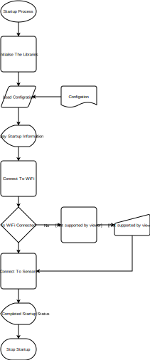

# Device and Sensors Setup

We are going to create a device from the following components.  Links will redirect you to Amazon website for the UK.  You will have to convert to your own region Amazon or use related website for the devices.  

* [ESP32 Development board](https://www.amazon.co.uk/gp/product/B076P8GRWV/ref=ppx_od_dt_b_asin_title_s00?ie=UTF8&psc=1)
* [Lithium Recharge Battery](https://www.amazon.co.uk/gp/product/B07CYMYMS9/ref=ppx_yo_dt_b_asin_title_o02_s00?ie=UTF8&psc=1)
* [GPS NEO-6M](https://www.amazon.co.uk/gp/product/B01N38EMBF/ref=ppx_od_dt_b_asin_title_s01?ie=UTF8&psc=1)
* [U.FL Mini PCI to SMA Female](https://www.amazon.co.uk/gp/product/B01LPXGJ2I/ref=ppx_yo_dt_b_asin_title_o02_s01?ie=UTF8&psc=1)
* [GPS External Ariel SMA](https://www.amazon.co.uk/Waterproof-Active-Antenna-28dB-Gain-Black/dp/B00LXRQY9A/ref=sr_1_5?dchild=1&keywords=gps+antenna&qid=1597056498&sr=8-5)
* [DSD Tech DHT22](https://www.amazon.co.uk/gp/product/B07CM2VLBK/ref=ppx_yo_dt_b_asin_title_o03_s00?ie=UTF8&psc=1)
* [LiDAR Sensor](https://www.amazon.co.uk/MakerHawk-Single-Point-Compatible-Communication-Interface/dp/B0778B15G7/ref=sr_1_5?dchild=1&keywords=lidar+sensor&qid=1597056770&sr=8-5)

The _**GPS External Ariel/5 U.FL Mini PCI to SMA Female**_ is really only needed if you want to program the device inside a warm environment or not.  I know you can sometimes get a satellite lock indoors, but its not reliable as you need line of sight for this lock.

I have added in a 3 LED's to show power on, reading sensors and sending to the cloud status.

The OLED display on the ESP32 board will display information on startup and normal mode.

## Startup Process

### WPS Mode

The device will automatically switch to WPS mode under the following conditions.

1. Never linked to a router before
1. Cannot find previous router
1. Cannot connect in a timely manner to an existing router

It will display `waiting for WPA` and give a count of seconds it has waited for.  The user will then be able to press the routers WPA button and reset the ESP32 to try again.  During testing I have noticed it asks for WPA 1 in 10 resets.  I had to just reset it again to connect automatically.  

>__*I leave it up to the reader to add the code to automatically reset if it detects that the router's SSID is detected and within range (DB Strength).*__

### Configuration File

The ESP 32 device has the ability to store files in the flash area of memory.  It is basically a file system.  It is explained in the [SPIFF](https://docs.espressif.com/projects/esp-idf/en/latest/esp32/api-reference/storage/spiffs.html) documentation by [Espressif](https://www.espressif.com/), who manufacturer and develop this range of SOC microcontroller.

I am using [JSON](https://www.json.org/json-en.html) file layout for the configuration.  I know its not the most efficient file structure, but it is easy to read and modify by a human.

See [Device Sensor Configuration](./DeviceConfigSetup.md) for full details.

## Building The System

I have already pre-soldered ESP32 Development board, GPS NEO-6M, and DHT-22 pins.  From the photos you can see I am not that good at soldering.

The following circuit diagram will help with the connecting of pins.

The pin numbers are the physical pin layout on the board.  The configuration settings uses logical pin layout.  

### Battery Connected Issue

There is an issue in that when the lithium battery is connected the device will stay switched on.  This will not be too much of issue when we have the full firmware loaded as it will automatically go to deep sleep (switched off) after an idle period.  The real issue is if you connect the battery up before connecting all the sensors etc you may short ciruit something and then damage the sensor, or the development board.

The process to connect up the sensors, ESP32 development board and battery will be outline below.

## 