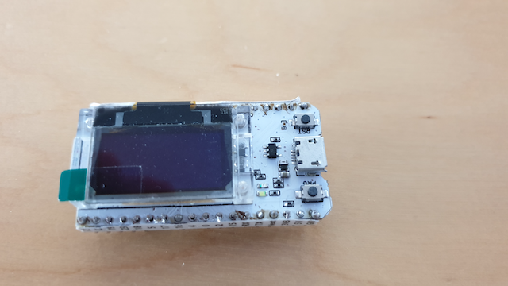
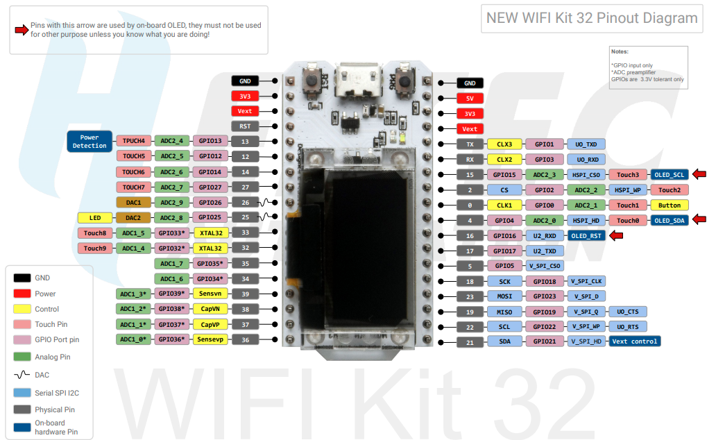
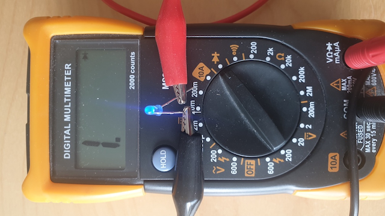
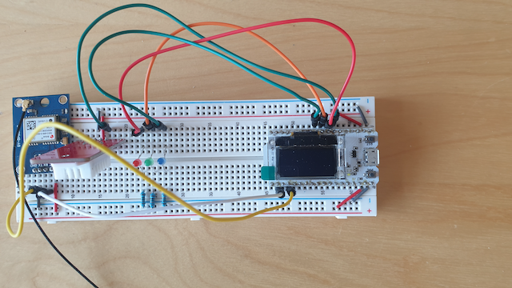
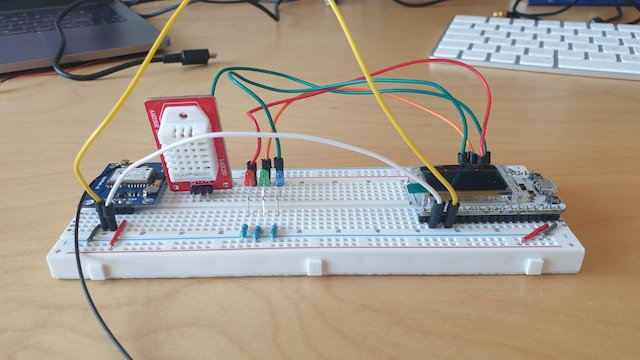
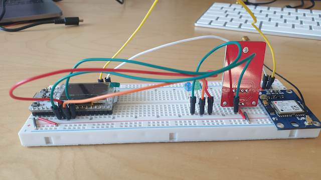

# Introduction

This article will show how to get an ESP32 WiFi development board to connect to either ([AWS](https://aws.amazon.com/) and [Azure](https://azure.microsoft.com/en-us/)) cloud providers.  It will do this by using the same x509 certificate and a configuration switch to indicate which cloud provider to use.  It combines 7 markdown documents that can be found in the GitHub repository named [esp32-iot-x509](https://github.com/gbd77rc/esp32-iot-x509).  The originals can be found in the docs folder.  The journey took about 3 weeks of digging around various sites, repositories, tutorials and experimentation.  I have encountered libraries that no longer work correctly or where never designed with x509 in mind, I am looking at Azure SDK for embedded devices which was palmed off to EDF.  I basically had to write my own cloud connection library, but in the end this ideal as I could then combine both AWS and Azure code into single cloud library.  

The will be series of articles because once the device is connected, what to do about the data it generate.  Thats a more important part!  So this article will tell you have to get the data into the cloud and the next will show how visualize it. 

## Terminology

Throughout this journey I will introduce some TLA.  Most of the meanings below I acquired from Wikipedia.  

| Term | Meaning                                                      |
| ---- | ------------------------------------------------------------ |
| CA   | **Certification Authority** - In cryptography, a **CA** is an entity that issues digital **certificates** |
| OTA  | **Over The Air** - This is process where the firmware on the device can be update/replace via remote communication. |
| SOC  | **System On a Chip** - is an integrated circuit (also known as a "**chip**") that integrates all or most components of a computer or other electronic **system** |
| TLA  | **Three Letter Acronym** - way of making a phrase with three words shorter by only using the first letters of the words: Three letter acronyms are very common in the world of computers! |

## The Device Story

The devices is based on ESP32 chip for this series.  The device will contain the following features, so we have a list of telemetry data points.

* Temperature/Humidity Detecting using DHT-22 sensor
* GPS for outdoor positioning
* Connected WiFi signal strength detection

If we have time we will use the WiFi repeaters around the area to workout the device location indoors.  This is based on the signal strength from each detect SSID.  This will more then likely be visited at the end of the series to show how to modify the code, and how to apply OTA updates.

I will cover how to wire up the sensors to the ESP-32 WiFi development board.

Why multiple different sensors?  Good question, and the answer is that I want to show how to use tasks within Arduino software that can run at different times on different cores in the ESP32 SOC.

The device will have individual x509 certificate so it can connect to the cloud platform without having hard coded password/tokens.  In a later article I may cover Just In Time Registration that both cloud providers support.

* [AWS](https://docs.aws.amazon.com/iot/latest/developerguide/jit-provisioning.html)
* [Azure](https://docs.microsoft.com/en-us/azure/iot-dps/about-iot-dps#:~:text=Microsoft%20Azure%20provides%20a%20rich,hub%20without%20requiring%20human%20intervention.)

The device will make use of Shadow/Device Twin features for configuration/telemetry data and/or standard topic for telemetry data.  

> It could have used standard topics for telemetry and control messages, but need to show off the sync cloud features.  Control topic messages may be covered in cloud related articles, AWS and Azure seem to do it differently or do they?

### Why NOT Google Cloud Platform (GCP)

I will not cover Google Cloud Platform, as it currently stands.  I believe it is currently not fully featured enough yet.  I expect it to be in the next year, if Google don't do their normal, its not making money so lets kill it mind set.  GCP has survived a few years now so it just may do succeed, also last year it seemed they have given up to compete with AWS as a SAAS platform and gone their own way.  Which I am really glad about.  We don't need another AWS look-a-like, but something different.  Multi-cloud is an option some companies need, and now with GCP we have a 3rd global player.

## Hardware Setup

We are going to create a device from the following components.  Links will redirect you to Amazon website for the UK.  You will have to convert to your own region Amazon or use related website for the components.  

* [ESP32 WiFi Development board](https://www.amazon.co.uk/gp/product/B076P8GRWV/ref=ppx_od_dt_b_asin_title_s00?ie=UTF8&psc=1)
* [GPS NEO-6M](https://www.amazon.co.uk/gp/product/B01N38EMBF/ref=ppx_od_dt_b_asin_title_s01?ie=UTF8&psc=1)
* [U.FL Mini PCI to SMA Female](https://www.amazon.co.uk/gp/product/B01LPXGJ2I/ref=ppx_yo_dt_b_asin_title_o02_s01?ie=UTF8&psc=1)
* [GPS External Ariel SMA](https://www.amazon.co.uk/Waterproof-Active-Antenna-28dB-Gain-Black/dp/B00LXRQY9A/ref=sr_1_5?dchild=1&keywords=gps+antenna&qid=1597056498&sr=8-5)
* [DSD Tech DHT22](https://www.amazon.co.uk/gp/product/B07CM2VLBK/ref=ppx_yo_dt_b_asin_title_o03_s00?ie=UTF8&psc=1)

The _**GPS External Ariel/5 U.FL Mini PCI to SMA Female**_ is really only needed if you want to program the device inside a warm environment or not.  I know you can sometimes get a satellite lock indoors, but its not reliable as you need line of sight for this lock.

I am using a standard breadboard and pre-cut cables.  


I have added in 3 LED's to show power on, wifi connected and cloud connected.

The OLED display on the ESP32 board will display information on startup and normal mode.

I have already pre-soldered ESP32 Development board.  From the photos you can see I am not that good at soldering.



The following circuit diagram will help with the connecting of pins.


The above circuit diagram does include an external power supply that uses a solar panel, lithium battery, and a step up booster.  As explained in the `External Power` section, this may or may not be done yet.



The pin numbers are the physical pin layout on the board.  The configuration settings uses logical pin layout, see the table in the diagram.  

### External Power

If we have time at the end I will show how we could connect the following

* [Lithium Recharge Battery](https://www.amazon.co.uk/gp/product/B07CYMYMS9/ref=ppx_yo_dt_b_asin_title_o02_s00?ie=UTF8&psc=1)
* [Solar Panel](https://smile.amazon.co.uk/gp/product/B01AFKP7UC/ref=ppx_yo_dt_b_asin_title_o00_s00?ie=UTF8&psc=1)
* [Li-ion Charging Module TP4056 + DW01](https://smile.amazon.co.uk/gp/product/B07GDRNDMS/ref=ppx_yo_dt_b_asin_title_o00_s01?ie=UTF8&psc=1)
* [MT3608 Step-Up Adjustable DC-DC](https://smile.amazon.co.uk/gp/product/B07MY3NZ18/ref=ppx_yo_dt_b_asin_title_o00_s00?ie=UTF8&psc=1)
* [USB Type B connectors](https://smile.amazon.co.uk/gp/product/B07TT23RCP/ref=ppx_yo_dt_b_asin_title_o09_s00?ie=UTF8&psc=1)

The EPS32 Development board accepts 5v via the USB connector, but the battery connector underneath only seems to accept the 3.7v from the Lithium battery.  This is a problem in that the GPS needs between 3.3v and 5v, closer to 5v the better to get a satellite fix.  The ESP32 board has an onboard voltage regulator, so we don't need to worry about frying the ESP32 chip itself and I think this is where we run into difficulties.  The other option to investigate is if we use the USB B connector or bypassing the underneath battery connector and feed the stepped up 5.2v directly.  

Still waiting for information from the manufacturer about the 3.3v and 5v power pins and acceptable power inputs.  The power pins do not switch off when you tell the ESP32 chip to go to deep sleep.  I think this will end up being a separate article.

### Testing LED

The LED has a negative and positive leg.  Its important that you get them the right way around or else at best it does not light up or worst you will blow it.  Not seen them blow up with these types of setups, but if you apply enough voltage they can. Generally the short leg is the negative and the long leg is positive.  If you have cut the legs to fit a circuit, how can you tell.  The best way I have found is using a multimeter. They generally have a diode tester option, well thats what I call it, I bet someone will correct me here.



Connect the negative and positive probes and the LED should light up.  Switch the probes around if not.  Now you know which side is the negative.

> On a side note, the resistor value of 330ohms is used for each LED.  This may not be correct depending on the LED colour value, but should not cause any real problem.  The main problem will be that the LED will not be bright as it could be.  For brightness control, the GPIO pins should support analog mode.

### Actual Layout

The following images are of the board from different views.





## Developing the firmware

We will be developing the firmware using [Arduino](https://arduino.cc) open-source electronics platform, using [Platform.io](https://platform.io/) as the development platform.

I will not be going thought the firmware line by line as that will be boring.  I will leave it up to you to decide if you wish to do that.  Instead I will go through the why of each library and what to look out for.  By the time this article has been published I will have commented each library and give some examples where I think the code is not clear enough.  I have assumed you have cloned/downloaded [esp32-iot-x509](https://github.com/gbd77rc/esp32-iot-x509) repository locally.

### Platform IO - Non-standard

If you open up the `platformio.ini` file in the root of the repository you will notice this section

```ini
[platformio]
data_dir = firmware/data
src_dir = firmware/src
include_dir = firmware/include
lib_dir = firmware/lib
```

Normally, this would not be needed.  As I will be including multiple different projects in this repository it will be required.  

For general development practices, each app, program, website, documentation would have its own repository to build from.  This would make the CI/CD pipeline easier to implement.

I have added in following to the project section of the `platform.ini` file.

```ini
upload_port = /dev/cu.SLAB_USBtoUART
monitor_port = /dev/cu.SLAB_USBtoUART
```

This is because I have multiple USB ports on my Mac and don't want to have to specify which port to use when I upload to the device or use the monitoring.  You can either remove these entries or update them to your USB port identifier.  

> I have noticed on Windows platform the COM port identifier increments if it things the port is in use between uploads at random times.  This may have been a quirk on my system.

### Multiple Threads/Tasks

The ESP32 device has 2 cores, this allows for multiple processes/task to be performed at once.  The timing can be issue here with the possible race conditions that could follow, like reading of pins that share the same hardware interrupts. With that being said some of tasks will take Mutex before beginning checking the sensor and then hand back the Mutex when finished.  

Not all tasks will require to be ran on core 0 either.  We will see what the balance is like during the development.  Currently thinking that the check for cloud messages can be ran on the core 1, along with the other standard functions for display and loop functions.

### Libraries

The firmware will use a mix of libraries from 3rd party and the ones I have created.  

All 3rd party libraries are registered in the `platformio.ini` file, in the `lib_deps` setting.

All developed libraries are in the `lib` folder.  By the time this is published you should find the following in each `lib` sub folder.  The `.cpp` and `.h` files that contain the library and a `readme.md` that will explain it.

### Development IDE

The recommended IDE from Platform.io is [Visual Studio Code](https://code.visualstudio.com/download) and use the [PlatformIO IDE](https://marketplace.visualstudio.com/items?itemName=platformio.platformio-ide) extension.  Personally I have a lot more extensions added for cloud interaction, formatting, docker/containers etc, but will not cover those.

This is a great open source IDE.  It can be a bit limiting sometimes, depends on the language you are using, like Java.  

With the `PlatformIO` extension install you should see the following navigation icon in the `Activity Bar`


When selected you should see the following in the `Sidebar`


The important options are as follows.

| Option                   | Meaning                                                      |
| ------------------------ | ------------------------------------------------------------ |
| Build                    | Used to test compilation locally really.                     |
| Upload                   | Used to flash the device of the compiled code.  It will detect if needs compilation again if required. |
| Monitor                  | Use to monitor the Serial communication that the device uses.  See `Logging` library for details.  By the time the monitor is connected the device may have been running for a few seconds, just press the reset button to see the log from the start. |
| Upload File System Image | This will load on the flash all the files and folder in the `data` folder.  See the [SPIFF](https://docs.espressif.com/projects/esp-idf/en/latest/esp32/api-reference/storage/spiffs.html) documentation on how to read/write files from the device.  This is required whenever the `config.json` or replacement certificates are changed.  As the PlatformIO system knows where the folder is, it will upload the image to device. |

### Language

The firmware is going to be written in C/C++ version 11, so we are not going to be using any of the fancy features that 14 and 17 give.  That being said, we don't really need them.

### ESP32 Development Board

This board has some nice features, like inbuilt WiFi controller, 8MB of flash storage, low power draw when in deep sleep (800uA) to name a few.  There is a different version of the board that support LoRAN communication as well.  If I have time at the end I may incorporate that version with this setup.

### Libraries

All sensors, logging and sleep/wake are controlled via a configuration.  So to make this easier to manipulate I have created a base class that these libraries can inherit from.  Therefore the first library created was the configuration manipulation one.

> Most of the libraries depends heavily on the [ArduinoJSON](https://arduinojson.org/) v6 library for handling of the JSON file.  I would recommended at least reading their [common errors and problems](https://arduinojson.org/v6/error/) section. 

#### Configuration

This library will have two classes defined in it. The `BaseConfigInfoClass` is really just an interface that each class the needs to handle configuration must inherit from.  The `ConfigClass` handles the actual loading/saving of the configuration file and the logic around when to save.  We don't want to save always, as their is limit on the number times the flash memory can be written to.

The `ConfigClass` does make uses of the `LogInfoClass`, so you may think there is race/deadlock condition here, as logging requires configuration.  It does not, as it just sets the level that the log messages are sent to the serial port and nothing else.

There is a single instance named `Configuration` already initialised.

#### Logging

The logging library uses the configuration to determine which level it will report on.  The single instance name is `LogInfo`.  Why LogInfo, basically because there is another 3rd party library that uses `Logging` as their instance name, so to avoid conflicts I renamed mine.

Example of Logging Output

```shell
398:VRB:1:CPU Id is 105783B5AA8C
```

***398:*** is the milliseconds since start of the device  

***VRB:*** is the logging status  

***1:*** is the processor ID that the log was created on  

***CPU Id is 105783B5AA8C*** is the actual message  

LED


